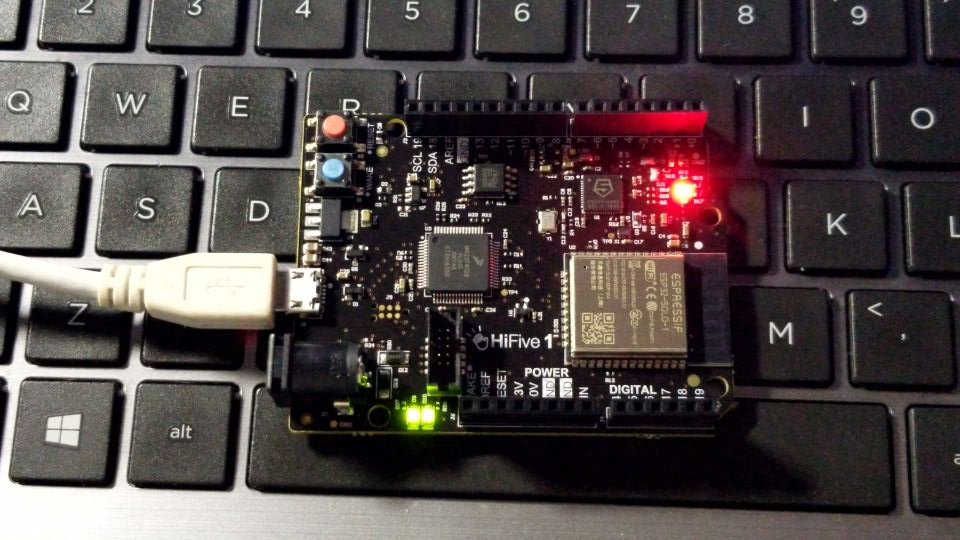

# Hifive1 RevB Demo

### How To Run

You need to use the Freedom Studio to run the code,

1. Create a new empty project

   New - Create Freedom E SDK Project- choose empty project - Finish

2. Add the code to project/src
3. Run / Debug

### 01 ASM Super Blink

This demo is basically forked  from Western Digital RISC-V ASM Tutorials, the demo will make the LED flashes red, green and blue in turn.

And this demo is written by RISC-V assembly language, it's very helpful for you to learn how the CPU control the devices and how to read a board manual, the video you can get from [youtube](https://www.youtube.com/watch?v=KLybwrpfQ3I&list=PLVoeqzsWSTSvDBmOk9EpqKl03GpVOlWvz&index=2&t=12s) or [bilibili](https://www.bilibili.com/video/av79840593)

